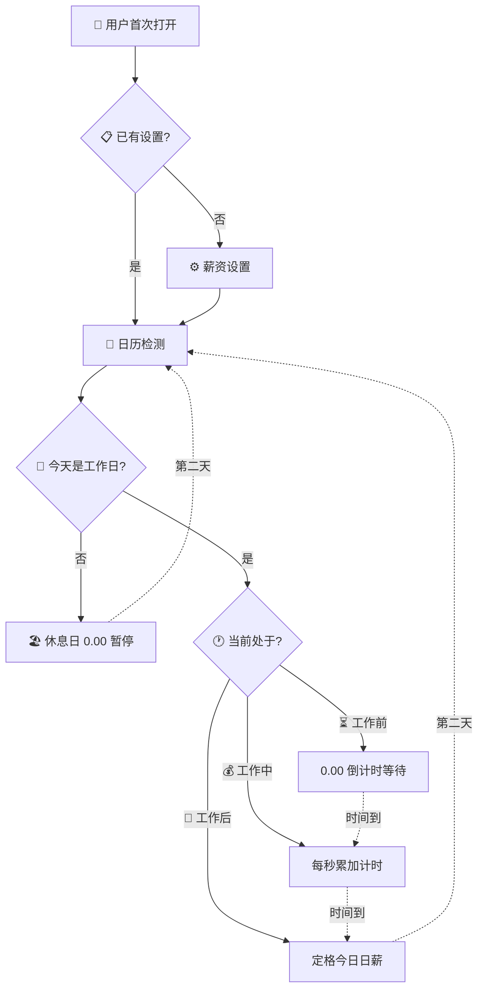

# 🦅 时薪桌面钟 · 宏观鸟瞰图

> 最高层级的总流程，不超过7个节点，一眼看懂产品骨架。

### 文字说明

| 节点 | 发生了什么 | 用户看到什么 |
|------|-----------|-------------|
| 🔰 首次打开 | 页面加载，检查本地是否有存储的设置 | 设置表单 或 时钟界面 |
| ⚙️ 薪资设置 | 输入月薪、工作天数、工作时间段 | 3步表单 |
| 📅 日历检测 | 读取内置节假日数据 + 当天日期 | 自动判断，无需操作 |
| 🏖 休息日 | 法定节假日 / 周末 | "今日休息" + 节假日名称 / "享受周末" |
| ⏳ 工作前 | 距上班还有一段时间 | 0.00 + 倒计时"距开始还有 XX:XX" |
| 💰 工作中 | 处于工作时间段内 | 数字每秒跳动增长 |
| 🏁 工作后 | 今天的工作时间已结束 | 定格"今日 ¥XX.XX" |

### 核心设计哲学

> 用户只需要做一件事：**设置一次参数**。之后每次打开，系统自动判断日期和时间，零操作。

---

*下一篇: [02-用户设置流程](02-用户设置流程.md)*
