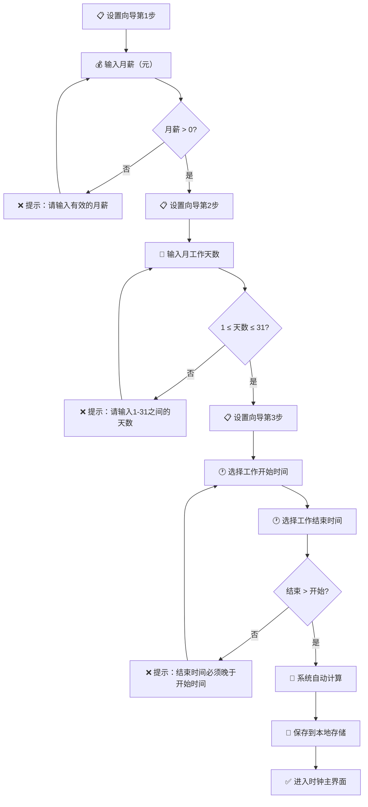

# ⚙️ 时薪桌面钟 · 用户设置流程

> 用户首次使用时的薪资参数设置全流程，含校验和边界处理。



### 🧮 系统计算逻辑

```
每日工作小时数 = 工作结束时间 - 工作开始时间
每日薪资       = 月薪 ÷ 月工作天数
每秒薪资       = 每日薪资 ÷ 每日工作小时数 ÷ 3600

示例：
  月薪 15000 ÷ 22天 ÷ 8小时 ÷ 3600秒 = 0.0237 元/秒
  即每秒赚约 2.37 分钱
```

### 校验规则一览

| 字段 | 规则 | 错误提示 |
|------|------|----------|
| 月薪 | > 0，支持小数 | "请输入有效的月薪" |
| 月工作天数 | 1-31 整数 | "请输入1-31之间的天数" |
| 工作开始时间 | 合法时间格式 | "请选择有效的时间" |
| 工作结束时间 | 必须晚于开始时间 | "结束时间必须晚于开始时间" |
| 工作时间段长度 | > 0 小时 | "工作时间段不能为空" |

### 💾 存储数据结构

```json
{
  "monthlySalary": 15000,
  "workingDays": 22,
  "workStartTime": "09:00",
  "workEndTime": "18:00",
  "perSecondRate": 0.0237,
  "dailySalary": 681.82,
  "createdAt": "2026-06-24T10:30:00",
  "updatedAt": "2026-06-24T10:30:00"
}
```

### 🔄 二次进入逻辑

```
页面加载 → 检查 localStorage 有无设置
  → 有设置 → 跳过设置向导 → 直接进时钟主界面
  → 无设置 → 显示设置向导
```

### 细节说明

- **3步向导式**：每步只做一件事，降低认知负担
- **即时校验**：输入框失焦即校验，不等提交按钮
- **预设值**：提供常见默认值（如 09:00-18:00），一键填充
- **可修改**：设置完成后可在主界面的设置入口修改

---

*上一篇: [01-宏观鸟瞰图](01-宏观鸟瞰图.md) · 下一篇: [03-三态时间检测](03-三态时间检测.md)*
