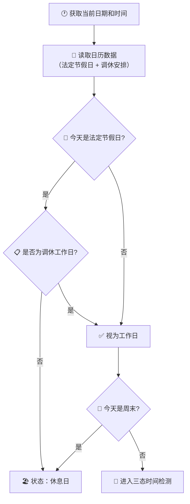
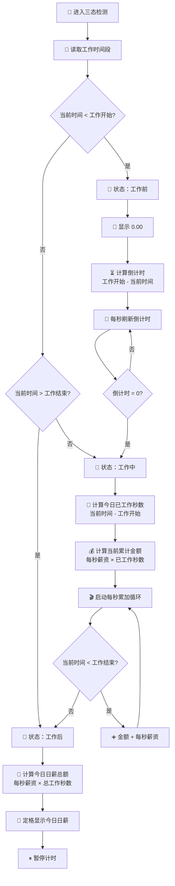
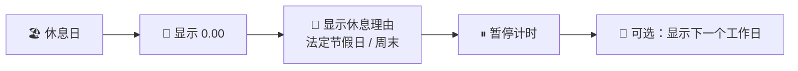

# 🕐 时薪桌面钟 · 智能时间检测与分流

> **核心差异化功能**：没有任何竞品做到了智能时间检测。这是产品的灵魂。

## 第一层：工作日判断（新增 🆕）

在进入三态检测之前，首先判断**今天是不是工作日**。



> 💡 **法定节假日 vs 调休**：比如国庆10月1日-7日是法定假，但前后某个周六被调为上班——这就是"调休工作日"。系统需要同时识别这两种情况。

---

## 第二层：三态时间检测



---

## 🆕 新增状态：休息日

| 触发条件 | 显示内容 | 视觉调性 |
|----------|----------|----------|
| 法定节假日（非调休） | "🎌 今日休息 · 法定节假日" | 暖金色，节日氛围 |
| 普通周末 | "☀️ 今日休息" | 柔和蓝紫，放松感 |
| 用户设置的工作日之外 | "☀️ 今日休息" | 同上 |



### 四态完整对照表

| 状态 | 触发条件 | 显示内容 | 计时器 | 用户感受 |
|------|----------|----------|:---:|------|
| 🏖 **休息日** | 法定假日 / 周末 | `¥0.00` + 休息原因 | ⏸ 暂停 | "今天好好休息～" |
| ⏳ **工作前** | 工作日 + 未到上班时间 | `¥0.00` + 倒计时 | ⏸ 暂停 | "还有XX分钟就开始赚钱了" |
| 💰 **工作中** | 工作日 + 工作时间段内 | `¥XX.XX` 每秒跳动 | ▶ 运行 | "每一秒都在变多" |
| 🏁 **工作后** | 工作日 + 已过下班时间 | `¥XX.XX` 定格 | ⏸ 暂停 | "今天赚了这么多！" |

---

## 📅 日历数据方案

### MVP方案：内置年度节假日 JSON

```json
{
  "year": 2026,
  "holidays": {
    "2026-01-01": { "name": "元旦", "isOffDay": true },
    "2026-01-28": { "name": "除夕", "isOffDay": true },
    "2026-01-29": { "name": "春节", "isOffDay": true },
    "2026-01-30": { "name": "春节", "isOffDay": true },
    "2026-01-31": { "name": "春节", "isOffDay": true },
    "2026-02-01": { "name": "春节", "isOffDay": true },
    "2026-02-02": { "name": "春节", "isOffDay": true },
    "2026-04-05": { "name": "清明节", "isOffDay": true },
    "2026-05-01": { "name": "劳动节", "isOffDay": true },
    "2026-05-31": { "name": "端午节", "isOffDay": true },
    "2026-09-25": { "name": "中秋节", "isOffDay": true },
    "2026-10-01": { "name": "国庆节", "isOffDay": true },
    "2026-10-02": { "name": "国庆节", "isOffDay": true },
    "2026-10-03": { "name": "国庆节", "isOffDay": true },
    "2026-10-04": { "name": "国庆节", "isOffDay": true },
    "2026-10-05": { "name": "国庆节", "isOffDay": true },
    "2026-10-06": { "name": "国庆节", "isOffDay": true },
    "2026-10-07": { "name": "国庆节", "isOffDay": true }
  },
  "makeupWorkdays": [
    "2026-02-07",  // 春节调休
    "2026-02-14",  // 春节调休
    "2026-04-26",  // 五一调休
    "2026-09-20",  // 中秋调休
    "2026-09-27",  // 国庆调休
    "2026-10-10"   // 国庆调休
  ]
}
```

> ⚠️ **维护提醒**：每年国务院发布次年放假安排后（通常在11-12月），需要更新这份 JSON。MVP版本内置数据，未来可考虑对接API自动更新。

### 未来方案（Nice to Have）

| 方案 | 优点 | 缺点 |
|------|------|------|
| 订阅 ICS 日历 | 自动更新，无需手动维护 | 需要网络，依赖第三方 |
| 调用政府API | 官方数据 | 政府不一定有公开API |
| 内置多年数据 | 离线可用 | 文件变大，需每年更新 |

---

## 关键边界处理

| 场景 | 处理方式 |
|------|----------|
| 刚好等于工作开始时间 | 判定为"工作中"，立即开始累加 |
| 刚好等于工作结束时间 | 判定为"工作中"，下一秒变"工作后" |
| 法定节假日 + 但也有调休安排 | 以调休安排为准（`makeupWorkdays` 优先） |
| 跨天（午夜） | 每天独立计算，刷新时重新判断当天 |
| 当前设备时间不准确 | 使用 `Date.now()` 读取系统时间 |
| 日历数据缺失（年份不匹配） | 降级为纯三态检测 + 提示用户"日历未更新" |

---

## 刷新/重新打开的处理

```
页面加载 → 读取存储设置 → 读取日历数据 → 获取当前日期
  → 今天是休息日？ → 进入休息日状态
  → 今天是工作日？ → 获取当前时间 → 三态判断
    → 工作中：回溯计算从工作开始到现在的累计金额 → 继续累加
    → 工作前/后：直接进入对应暂停状态
```

> 💡 **为什么这是核心差异化？** 其他竞品都是"秒表模式"——你来按开始。我们是"时钟+日历模式"——打开就自动在正确的状态。从"工具"变成"伙伴"。

---

*上一篇: [02-用户设置流程](02-用户设置流程.md) · 下一篇: [04-实时累加循环](04-实时累加循环.md)*
