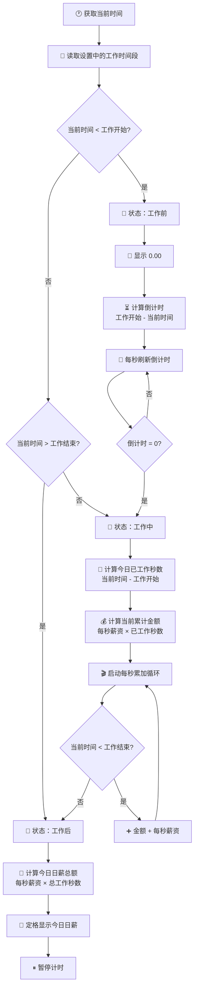

# 🕐 时薪桌面钟 · 三态时间检测与分流

> **核心差异化功能**：没有任何竞品做到了智能三态自动检测。这是产品的灵魂。



### 三态对照表

| 状态 | 触发条件 | 显示内容 | 计时器 | 用户感受 |
|------|----------|----------|:---:|------|
| ⏳ **工作前** | 当前 < 工作开始 | `¥0.00` + 倒计时 | ⏸ 暂停 | "还有XX分钟就开始赚钱了" |
| 💰 **工作中** | 工作开始 ≤ 当前 ≤ 工作结束 | `¥XX.XX` 每秒跳动 | ▶ 运行 | "每一秒都在变多" |
| 🏁 **工作后** | 当前 > 工作结束 | `¥XX.XX` 定格 | ⏸ 暂停 | "今天赚了这么多！" |

### 三态视觉表现（规划）

```
工作前                      工作中                      工作后
┌──────────────┐          ┌──────────────┐          ┌──────────────┐
│              │          │              │          │              │
│   ⏳ 00:00   │          │  ¥ 86.42     │          │  ¥ 681.82    │
│   距开始还有  │          │  ▴ 跳动中    │          │  今日已定格  │
│   32:15      │          │              │          │              │
│              │          │  灰色/静止    │          │  金色/定格   │
│   ¥ 0.00     │          │  ¥ XX.XX     │          │  ¥ XXX.XX    │
└──────────────┘          └──────────────┘          └──────────────┘
   灰色调                     绿色跳动                    金色定格
```

### 关键边界处理

| 场景 | 处理方式 |
|------|----------|
| 刚好等于工作开始时间 | 判定为"工作中"，立即开始累加 |
| 刚好等于工作结束时间 | 判定为"工作中"，但下一秒即变"工作后" |
| 跨天（午夜） | 每天独立计算，刷新时重新判断当天 |
| 当前设备时间不准确 | 使用 `Date.now()` 读取系统时间（用户自行保证准确） |
| 跨时区 | MVP只支持单一时区，读取设备本地时间 |

### 刷新/重新打开的处理

```
页面加载 → 读取存储的设置 → 获取当前时间 → 三态判断
  → 工作中：回溯计算从工作开始到现在的累计金额 → 从该金额继续累加
  → 工作前/后：直接进入对应暂停状态
```

> 💡 **为什么这是核心差异化？** 其他竞品都是"秒表模式"——你来按开始。我们是"时钟模式"——打开就自动在正确的状态。从"工具"变成"伙伴"的关键一步。

---

*上一篇: [02-用户设置流程](02-用户设置流程.md) · 下一篇: [04-实时累加循环](04-实时累加循环.md)*
