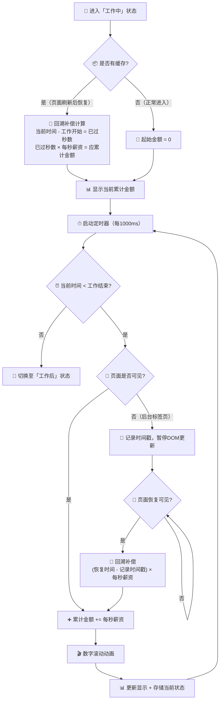

# 💰 时薪桌面钟 · 实时累加循环

> "沙漏式"每秒递增的核心循环逻辑，含回溯补偿和防抖处理。



### 累加公式

```
每秒薪资(s) = 月薪 ÷ 月工作天数 ÷ (工作结束 - 工作开始)小时 ÷ 3600

实时累计金额 = s × 从工作开始到此刻的秒数

每过1秒 → 累计金额 += s
```

### 定时器策略

| 方案 | 频率 | 优点 | 缺点 |
|------|------|------|------|
| `setInterval(1000)` | 每秒1次 | 简单，够用 | 可能因事件循环延迟累积偏差 |
| `requestAnimationFrame` | ~60fps | 极度流畅 | 需要额外逻辑控制更新频率 |
| **混合（推荐MVP）** | 每秒1次 + 首帧补偿 | 够流畅，不复杂 | — |

**MVP采用方案**：`setInterval(1000ms)` 为主，进入时用一次即时计算补偿因JS事件循环导致的微小延迟。

### 页面后台处理

```
标签页隐藏时：
  → 记录隐藏时间戳
  → 停止DOM动画（节省资源）
  → 定时器继续运行（或不运行，恢复时补偿）

标签页恢复时：
  → 计算后台时长
  → 一次性补偿金额 = 每秒薪资 × 后台秒数
  → 数字直接跳到正确值 + 恢复每秒跳动
```

### 防止数字跳动"抖动"

```javascript
// 伪代码：使用固定基准时间而非累加
const baseTime = workStartTime;  // 固定的工作开始时间
const perSecondRate = 0.0237;    // 每秒薪资

function updateDisplay() {
    const now = Date.now();
    const elapsedSeconds = (now - baseTime) / 1000;
    const amount = elapsedSeconds * perSecondRate;
    display.textContent = amount.toFixed(2);
}

setInterval(updateDisplay, 1000);
```

> 💡 **关键设计**：用"绝对时间差 × 速率"而非"每次 += 增量"。这样即使某次定时器延迟了，显示的值也是正确的——不会因为累积误差越偏越远。

### 存储策略

每 30 秒自动存储一次当前状态到 `localStorage`（防抖，避免频繁写入）：

```json
{
  "lastUpdateTime": "2026-06-24T14:32:00",
  "currentAmount": 86.42,
  "state": "working"
}
```

如果页面崩溃或关闭，下次打开时能恢复到最近 30 秒内的状态。

---

*上一篇: [03-三态时间检测](03-三态时间检测.md) · 下一篇: [05-状态机总览](05-状态机总览.md)*
