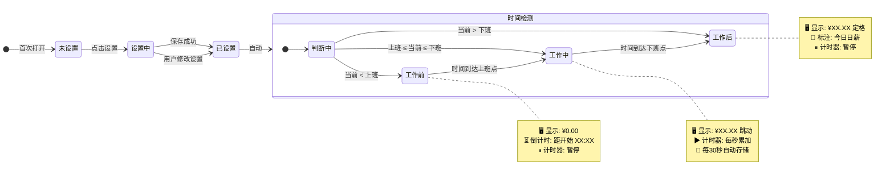

# 🤖 时薪桌面钟 · 状态机总览

> 完整的状态转换图，覆盖所有正常路径和边界情况。



### 完整状态转换表

| 当前状态 | 触发事件 | 目标状态 | 动作 |
|----------|----------|----------|------|
| `未设置` | 首次打开，无存储数据 | `设置中` | 显示设置向导 |
| `设置中` | 用户完成输入并保存 | `已设置` | 存储 → 进入时钟 |
| `已设置` | 自动（保存后立即触发） | `时间检测` | 读取当前时间 |
| `时间检测` | 当前 < 工作开始 | `工作前` | 显示 0.00 + 倒计时 |
| `时间检测` | 工作开始 ≤ 当前 ≤ 工作结束 | `工作中` | 回溯计算 → 开始累加 |
| `时间检测` | 当前 > 工作结束 | `工作后` | 显示今日日薪 |
| `工作前` | 倒计时归零 | `工作中` | 自动切换，开始累加 |
| `工作中` | 当前时间 = 工作结束 | `工作后` | 定格日薪 |
| `工作后` | 第二天打开页面 | `时间检测` | 重新判断新的一天 |

### 每天自动重置

```
新的一天 = 日期变更（00:00）
  → 如果用户在 00:00 后打开页面
    → 重新三态检测
    → 昨天的工作后状态自动变成今天的工作前状态
```

### 异常场景处理

| 异常 | 处理 |
|------|------|
| 工作时间段设成 00:00-00:00 | 校验拦截，不允许保存 |
| 用户在"工作前"时修改设置 | 立即重新三态检测 |
| 用户在"工作中"时修改设置 | 用新速率继续累加，不改累计金额 |
| 浏览器时间被手动修改 | 使用 `Date.now()`，跟随系统。用户自行负责时间准确 |
| localStorage 被清空 | 回退到"未设置"状态 |
| localStorage 数据损坏 | try-catch 解析 → 失败则回退"未设置" |

### 一个完整的用户一天

```
07:30 打开页面 → 🕐 检测 → ⏳「工作前」显示 0.00，倒计时 1:30:00
08:59 倒计时 0:01:00
09:00 时间到 → 💰 自动切换「工作中」¥0.00 开始跳动
09:01 ¥1.42
10:00 ¥85.23
12:00 ¥256.00 ... 持续跳动
17:59 ¥679.50
18:00 时间到 → 🏁 自动切换「工作后」定格 ¥681.82
18:01 依然定格 ¥681.82（暂停）
22:00 打开页面 → 🏁 仍然「工作后」定格 ¥681.82
第二天 07:30 → ⏳ 新的一天，「工作前」
```

---

*上一篇: [04-实时累加循环](04-实时累加循环.md)*
