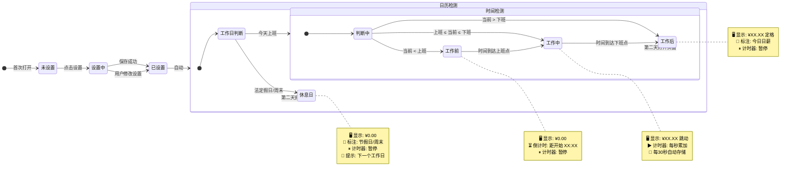

# 🤖 时薪桌面钟 · 状态机总览

> 完整的状态转换图，覆盖所有正常路径和边界情况。**v2.0 新增「休息日」状态。**



### 完整状态转换表

| 当前状态 | 触发事件 | 目标状态 | 动作 |
|----------|----------|----------|------|
| `未设置` | 首次打开，无存储数据 | `设置中` | 显示设置向导 |
| `设置中` | 用户完成输入并保存 | `已设置` | 存储 → 进入时钟 |
| `已设置` | 自动 | `日历检测` | 读取日历 + 当前日期 |
| `日历检测` | 法定假日/周末 | `休息日` | 显示 0.00 + 休息原因 |
| `日历检测` | 工作日 | `时间检测` | 进入三态判断 |
| `时间检测` | 当前 < 工作开始 | `工作前` | 显示 0.00 + 倒计时 |
| `时间检测` | 工作开始 ≤ 当前 ≤ 工作结束 | `工作中` | 回溯计算 → 开始累加 |
| `时间检测` | 当前 > 工作结束 | `工作后` | 显示今日日薪 |
| `工作前` | 倒计时归零 | `工作中` | 自动切换，开始累加 |
| `工作中` | 当前时间 = 工作结束 | `工作后` | 定格日薪 |
| `休息日` | 第二天打开页面 | `日历检测` | 重新判断新的一天 |
| `工作后` | 第二天打开页面 | `日历检测` | 重新判断新的一天 |

### 每天自动重置

```
新的一天 = 日期变更（00:00）
  → 如果用户在 00:00 后打开页面
    → 重新日历检测 + 时间检测
    → 昨天的任何状态自动刷新
```

### 异常场景处理

| 异常 | 处理 |
|------|------|
| 工作时间段设成 00:00-00:00 | 校验拦截，不允许保存 |
| 法定假日但被调休 | 以调休安排为准（`makeupWorkdays` 优先） |
| 日历数据缺失（年份不匹配） | 降级为三态检测 + 提示"日历数据需更新" |
| 用户在"工作前"时修改设置 | 立即重新日历+时间检测 |
| 用户在"工作中"时修改设置 | 用新速率继续累加，不改累计金额 |
| 浏览器时间被手动修改 | 使用 `Date.now()`，跟随系统 |
| localStorage 被清空 | 回退到"未设置"状态 |
| localStorage 数据损坏 | try-catch 解析 → 失败则回退"未设置" |

### 几个典型场景

#### 场景1：普通工作日
```
07:30 打开页面 → 📅 工作日 → 🕐 工作前 → ⏳ 0.00 + 倒计时 1:30:00
09:00 时间到 → 💰 工作中，每秒累加
18:00 时间到 → 🏁 工作后，定格 ¥681.82
```

#### 场景2：国庆节（法定假日）🆕
```
10月1日 09:00 打开页面 → 📅 检测到"国庆节"
  → 🏖 休息日，显示 ¥0.00 + "🎌 国庆节 · 今日休息"
  → ⏸ 暂停计时
```

#### 场景3：调休上班日（周六补班）🆕
```
10月10日（周六）08:00 打开页面
  → 📅 检测到"周末" → 但在 makeupWorkdays 列表中
  → ✅ 视为工作日 → 🕐 工作前 → ⏳ 倒计时
  → 09:00 开始正常累加
```

#### 场景4：连续假期后第一天上班
```
10月8日（国庆后）08:30 打开页面
  → 📅 工作日 → 🕐 工作前 → ⏳ 倒计时 0:30:00
  → 09:00 → 💰 工作中，正常累加
```

---

*上一篇: [04-实时累加循环](04-实时累加循环.md)*
